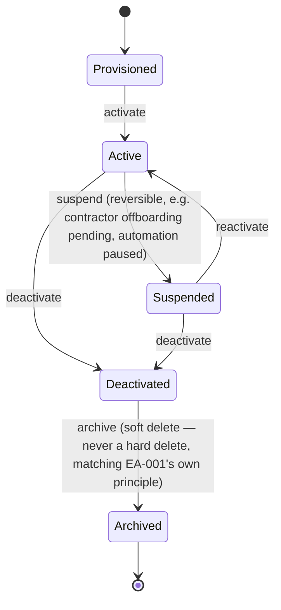
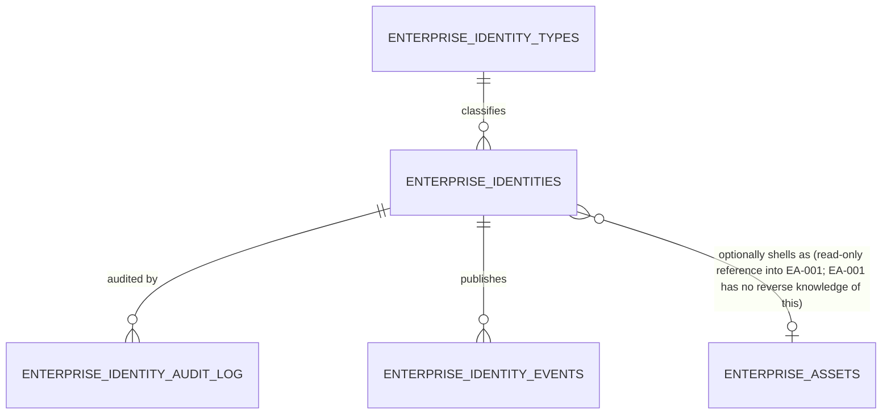
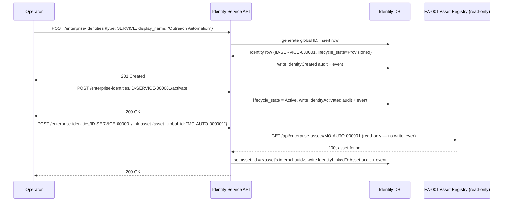
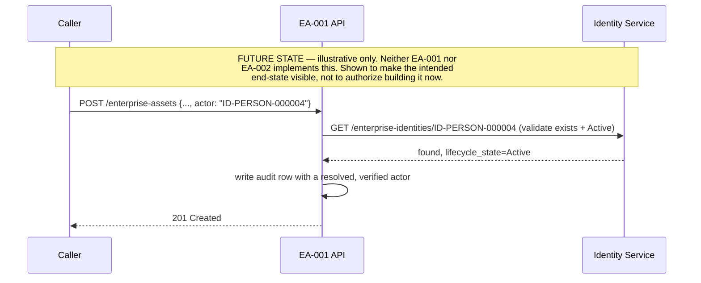

# EA-002 — Enterprise Identity Service: Design Specification

**Status:** Design package for review. No code, migration, or route has been written for this assignment — per instruction, this is discovery and design only. Cross-referenced against the actually-implemented EA-001 (not the design intent — the real, current schema and API) so the integration points below are grounded in what exists, not assumed.

**Scope discipline, stated once, applies throughout:** this document designs *identity* — the record of who or what can act within the Enterprise. It does not design authentication (proving an identity is who it claims), login (a UI/session concern), or permissions (what an identity may do). Every section below stays inside that boundary; where a natural extension into one of those areas would help the narrative, it's marked **(future, out of scope)** rather than silently designed in.

## 0. Grounding: what already exists

Before designing anything, the current state was checked directly rather than assumed:

- **No authentication provider exists anywhere in this codebase.** No middleware, no session handling, no `auth.users` usage. Confirmed by direct grep — matches every prior session's findings (EA0006, EI-001, D-005).
- **`ADMIN_EMAILS` is a display-only label**, not an enforced check (`src/app/(main)/settings/page.tsx:19` — `description: 'Who can access this dashboard'`, never read by any access-control logic).
- **D-007's Shared Services Catalogue (`src/lib/shared-services-catalogue.ts`) already has an "Enterprise Identity" entry**, and its `purpose` field conflates two different concerns: *"Establish who is acting within the Enterprise **and enforce access control** across every product and shared service."* Its `futureRoadmap` says "Choose and wire a real identity provider before any other shared service can assume a real 'current user.'" EA-002 deliberately narrows this: identity (who/what exists as an actor, this document) is separated from access control (what an actor may do, a future capability). This document does not silently inherit D-007's broader framing — it corrects it. See ADR-002 for the explicit reconciliation. (D-007's catalogue file itself is not edited by this assignment — that's implementation-adjacent maintenance belonging to whichever work package actually builds this, not a design package.)
- **EA-001 (Enterprise Asset Registry) is real, implemented, tested** (see its own Evidence Package) but **not yet applied to the live database**. Its `actor` field on every audit record is caller-supplied free text, defaulting to `'system'` — a disclosed limitation (ADR-001 decision 7) this design is a step toward resolving, without resolving it itself.

## 1. Identity Domain Model

An **Identity** is any actor MasterOps can recognize and attribute — as the subject of an audit record, the owner of an asset, or a participant in the enterprise relationship graph. It is a *record of existence*, not a *credential* and not a *grant of access*.

### Identity Types

Following EA-001's precedent exactly (ADR-001 decision 1: a lookup table, not a closed enum, so a new type is a row insert, never a schema change):

| Type code | Meaning | Example |
|---|---|---|
| `PERSON` | An individual human | Founder, a team member, a contractor |
| `SERVICE` | A non-human system actor | An automation, a scheduled job, an API integration client |
| `EXTERNAL` | An actor outside MasterOps' direct control that still needs to be referenceable | A vendor contact, a partner organization |
| `GROUP` | A named collection of other identities | *Proposed, not committed — see Open Question 1* |

**Open Question 1 — does `GROUP` overlap with EA-001's existing `TEAM` asset type?** EA-001 already has `TEAM` as one of its 9 seeded asset types (an asset-registry concern: a team as a governed enterprise thing). A `GROUP` identity would be a different concern (a team as a collection of actors, for attribution/ownership purposes). These may turn out to be the same real-world object viewed from two angles — exactly the pattern this design proposes for `SERVICE` identities and `AUTOMATION` assets (Section 3). Recommend deferring `GROUP` to a later phase once at least one real use case exists, rather than designing it speculatively now.

### Core fields (design-level — see Section 10 for the full proposed schema)

`global_id` (permanent, immutable), `identity_type_code`, `display_name`, `description`, `lifecycle_state` (Section 2 — deliberately **not** reusing EA-001's `lifecycle_stage` vocabulary, see below), `owner` (who is accountable for this identity record), `business_scope` (Section 5), `contact_email` (nullable, PERSON/EXTERNAL only), `metadata` (JSON, extensible), `asset_id` (nullable, Section 3), audit timestamps.

**Why `lifecycle_state` is a new vocabulary, not EA-001's `lifecycle_stage` reused:** EA-001's `lifecycle_stage` (`concept → building → pilot → live → growing → scaling → deprecated → retired`) measures a *product/asset's maturity*. An identity doesn't mature — it's provisioned, used, and eventually retired. Reusing the asset vocabulary here would be copying a word, not a concept; Section 2 defines the correct one.

## 2. Identity Lifecycle

- **Provisioned**: record exists, not yet usable as an attributable actor (e.g. created but pending a human's confirmation).
- **Active**: normal state, can be cited as an actor / owner / audit subject.
- **Suspended**: temporarily not usable (reversible) — e.g. an automation paused during an incident, a contractor's access under review. Distinguishing `Suspended` from `Deactivated` mirrors a real operational need EA-001's own two-state `active`/`archived` model doesn't have to handle, because assets don't get "temporarily paused" the way actors do.
- **Deactivated**: no longer an active actor, but not yet archived — kept distinct from `Archived` so there's a window between "stop using this identity" and "remove it from active views," matching EA-001's `archived_at` pattern conceptually.
- **Archived**: soft-deleted. Never hard-deleted, for the same audit-integrity reason EA-001 never hard-deletes assets — an identity that no longer exists must still be resolvable from historical audit records.

No transition skips a state in a way that loses information (e.g. `Active → Archived` directly is deliberately not offered — must pass through `Deactivated`), keeping the state machine's history legible.

## 3. Identity Relationships with the Enterprise Asset Registry (EA-001)

This is the section most likely to be over-engineered if not held to the "preserve loose coupling" instruction, so the reasoning is spelled out fully.

**Constraint discovered by reading EA-001's actual schema (not assumed):** `enterprise_asset_relationships` requires *both* `source_asset_id` and `target_asset_id` to be foreign keys into `enterprise_assets(id)`. It cannot link an asset to something that isn't itself a row in `enterprise_assets`. This rules out "just use EA-001's existing relationship table" as an integration mechanism unless every identity also becomes an asset row — which would be a real design mistake: an identity is not an inventory item MasterOps manages, it's an actor, and conflating the two would corrupt EA-001's own domain model (exactly the "no domain-model change" boundary the EA-001 production-readiness review protected).

**Decision: one optional, nullable, outbound foreign key — and nothing else.**

`enterprise_identities.asset_id` → `enterprise_assets.id`, nullable, populated only when an identity corresponds to something EA-001 already tracks as an asset. This is deliberately the *only* touchpoint:

- EA-001 gains **zero** new columns, tables, or knowledge of the Identity Service. It has no idea this FK exists from its side. This satisfies "preserve loose coupling" literally — the dependency is one-directional (Identity Service → EA-001), and EA-001 remains fully functional, testable, and deployable with the Identity Service never having existed.
- Reads only. When the Identity Service links an identity to an asset, it calls EA-001's existing `GET /api/enterprise-assets/{globalId}` (or the repository function directly, if same-process) to confirm the asset exists — it never writes to any EA-001 table.
- **Not every identity needs this link.** A `PERSON` identity (a human team member) has no natural EA-001 asset counterpart and should simply leave `asset_id` null. A `SERVICE` identity for an automation *can* link to that automation's `AUTOMATION`-type asset row in EA-001 — the same real-world thing (a piece of automation) viewed from two angles (EA-001: "this is a thing we govern"; Identity Service: "this is an actor that does things"). An `EXTERNAL` identity (a vendor contact) has no asset counterpart.

`ENTERPRISE_ASSETS` above is EA-001's own table, shown only to make the boundary visible — this design does not modify it.

## 4. Ownership Model

Two distinct kinds of "ownership" are at risk of being conflated here, so they're named separately:

1. **Record ownership** — who is accountable for keeping an identity record accurate (the `owner` field, a human, stored as free text for V1 the same way EA-001's `owner` field is — see Open Question 2). E.g. a `SERVICE` identity for an automation is "owned" by whichever team member is accountable for that automation.
2. **Asset ownership** — separate and already solved by EA-001 (its own `owner` field on `enterprise_assets`). The Identity Service does not duplicate or override this. If an identity is linked to an asset (Section 3), the asset's own `owner` field remains EA-001's source of truth for asset ownership; the identity's `owner` field answers a different question ("who's accountable for this identity record"), and the two are allowed to name different people without that being a data-integrity problem.

**Open Question 2:** EA-001's `owner` field is free text (no identity/user table existed yet when EA-001 was built, so there was nothing to reference). Once the Identity Service exists, should EA-001's `owner` field start being *populated with* identity global IDs going forward? This is genuinely tempting but is explicitly **not** decided here — it would mean EA-001 depends on the Identity Service, breaking the one-directional dependency this design is built around. Flagged as a real future trade-off in Section 11, not resolved.

## 5. Multi-Tenant Identity Strategy

MasterOps itself is not a multi-tenant SaaS product — it's a single admin platform serving the whole portfolio (per the Charter: MasterOps = Enterprise Platform, each product = its own Layer 4 Business Product with its own users, auth, and database). ELBOLD, for example, has its own separate Supabase project and no shared auth with MasterOps (confirmed in prior EI-001 work). **This means the Identity Service's remit is MasterOps-internal and cross-portfolio-operator identities — not each product's own end-customers.** Designing this service to also become the identity system for ELBOLD's or MeritBold's customers would violate the Charter's Layer 1 (Enterprise) vs Layer 4 (Business Product) boundary and is explicitly out of scope.

Given that, "multi-tenant" here means: an identity may be scoped to one specific business in the portfolio, or be enterprise-wide.

**Decision: `business_scope` is a nullable, soft (non-FK) text field holding one of the existing business slugs already defined in `src/lib/enterprise-registry.ts`'s `ENTERPRISE_REGISTRY`** (e.g. `'elbold'`, `'master-growth-os'`), or `null` for an enterprise-wide identity (the Founder, a MasterOps-internal automation).

- **Why soft, not a foreign key:** `enterprise-registry.ts` is a static TypeScript config array, not a database table (a deliberate D-006 decision — "configuration-driven, no database"). There is nothing to foreign-key into. A soft reference by slug is the only mechanism available, and it's consistent with how the rest of this codebase already treats that registry (nothing else FKs into it either).
- **Why not build a real `tenants` table instead:** that would mean re-deciding D-006's "config, not DB" call inside an identity-design assignment — out of scope, and unjustified until a real need for tenant-level identity queries (beyond simple filtering) appears.

## 6. Service Boundaries

The Identity Service is a bounded context, deployed as part of `masterops-ai` for V1 (same pattern as EA-001 — new schema namespace, not a new deployable), with these explicit non-responsibilities:

| Concern | Owned by Identity Service? | Owned by |
|---|---|---|
| Who/what exists as an actor | ✅ Yes | This service |
| Proving an identity is who it claims (passwords, tokens, sessions, MFA) | ❌ No | **(future)** Enterprise Authentication Service |
| What an identity is allowed to do (roles, permissions, RBAC) | ❌ No | **(future)** Enterprise Access Control |
| Login UI / session cookies | ❌ No | **(future)** Authentication Service's consumer-facing surface |
| A product's own end-customer accounts (ELBOLD customers, etc.) | ❌ No | Each product (Layer 4), per the Charter |
| Asset inventory/governance | ❌ No | EA-001 (read-only dependency, Section 3) |

## 7. Public API Proposal (design only — not implemented)

Mirrors EA-001's conventions (route shape, response envelope, error mapping) for platform consistency, since operators will use both.

| Method | Path | Purpose |
|---|---|---|
| `POST` | `/api/enterprise-identities` | Create Identity |
| `GET` | `/api/enterprise-identities` | List Identities (filter: type, status, business_scope; paginate/sort — same shape as EA-001's List) |
| `GET` | `/api/enterprise-identities/search?q=` | Search Identities (free text on display_name/description) |
| `GET` | `/api/enterprise-identities/{globalId}` | Get Identity |
| `PATCH` | `/api/enterprise-identities/{globalId}` | Update Identity (non-lifecycle fields) |
| `POST` | `/api/enterprise-identities/{globalId}/activate` | Provisioned → Active |
| `POST` | `/api/enterprise-identities/{globalId}/suspend` | Active → Suspended |
| `POST` | `/api/enterprise-identities/{globalId}/reactivate` | Suspended → Active |
| `POST` | `/api/enterprise-identities/{globalId}/deactivate` | Active/Suspended → Deactivated |
| `POST` | `/api/enterprise-identities/{globalId}/archive` | Deactivated → Archived (soft delete) |
| `POST` | `/api/enterprise-identities/{globalId}/link-asset` | Set the optional EA-001 `asset_id` link (Section 3) |
| `DELETE` | `/api/enterprise-identities/{globalId}/link-asset` | Clear the link |
| `POST` | `/api/enterprise-identities/validate` | Validate a payload without persisting (mirrors EA-001's Validate Asset) |

Explicitly **not** proposed: any `/login`, `/token`, `/session`, or `/permissions` endpoint — those belong to the future services in Section 6.

### Sequence: provisioning a Service identity and linking it to an EA-001 asset

Note the arrow direction: EA-001 never calls the Identity Service. The dependency is strictly one-directional, and EA-001's own test suite, build, and API remain entirely unaffected by whether the Identity Service exists.

### Sequence: a future (not implemented) consumer of Identity for EA-001's audit `actor`

This would require a change to EA-001 itself (validating `actor` against the Identity Service before writing an audit row) — out of scope for both EA-001's completed production-readiness pass and this design assignment. Recorded as a Phase 3 candidate in Section 9.

## 8. Security Considerations

Real considerations exist even without building authentication:

- **PII exposure.** `PERSON` and `EXTERNAL` identities will hold names and likely email addresses. Per the existing platform-wide pattern (ADR-001 decision 6), every table in this design would, if built exactly like EA-001, get an RLS read-all policy — but that pattern was justified for EA-001 because *nothing* in `enterprise_assets` is PII. It is **not** automatically justified here. **Recommendation: do not blanket-copy the read-all RLS pattern for `enterprise_identities`.** This is flagged as a decision the implementation phase must make deliberately, not inherit by habit — see ADR-002.
- **No credential storage, ever, in this service.** Explicitly a non-goal (Section 6) — if a future implementation is ever tempted to add a `password_hash` or `api_key` column to `enterprise_identities` "since it's convenient," that would silently smuggle authentication into a service designed not to hold it. Worth stating as a hard line for whoever implements this.
- **Self-service creation risk.** If `POST /enterprise-identities` is ever exposed without any access control (matching this platform's current everything-is-open pattern), it could be used to enumerate or spam-create identity records. Same class of risk EA-001 already carries and disclosed (no auth anywhere yet) — not new here, but worth re-flagging because identity records are more sensitive than asset records.
- **Audit-log immutability vs. data-subject deletion rights.** A `PERSON` or `EXTERNAL` identity may eventually need to be genuinely erased (e.g. a GDPR erasure request), but this service's own audit log (mirroring EA-001's `before`/`after` snapshot pattern) would otherwise retain that person's name/email indefinitely even after "archiving" the identity. **This is a real, unresolved tension, not silently resolved here** — EA-001's principle ("never hard-delete, audit trail is permanent") is appropriate for assets but may not be appropriate as-is for personal data. Recommend this be a named open decision in the implementation phase (e.g. redacting audit `before`/`after` payloads on erasure while keeping the audit *record* of the erasure event itself) rather than copying EA-001's pattern uncritically.
- **`business_scope` as a soft string field** (Section 5) means nothing prevents a typo'd or invented scope value from being stored — same open-vocabulary trade-off EA-001 accepted for `relationship_type` (ADR-001, Remaining Risk 3). Acceptable for V1, worth tightening later if the Identity Service becomes business-critical.

## 9. Migration Strategy

Phased, each phase independently approvable — nothing here authorizes building phase 2+ as part of accepting this design:

1. **Phase 1 (this design → future implementation):** Build the Identity Service schema and API standalone, exactly as designed above. Zero changes to EA-001. Zero changes to any other existing capability.
2. **Phase 2:** Backfill a small number of known real identities (the Founder, any currently-running automations) — manual/seed data, not a bulk migration, since no source of truth for "every actor" currently exists anywhere to migrate *from*.
3. **Phase 3 (separate future assignment, requires its own approval):** Begin optionally resolving EA-001's `actor` field against real Identity global IDs **for new writes only** — never rewriting historical audit rows (matches EA-001's own audit-immutability principle). This is the scenario shown in Section 7's second sequence diagram.
4. **Phase 4 (separate future assignment):** Build the Enterprise Authentication Service on top of Identity records (issuing real credentials/sessions).
5. **Phase 5 (separate future assignment):** Build Enterprise Access Control on top of Identity records (roles/permissions).
6. **Housekeeping (small, could accompany Phase 1's implementation):** Update D-007's `shared-services-catalogue.ts` "Enterprise Identity" entry — its `purpose` and `futureRoadmap` text currently conflates identity with access control (Section 0); once real identity exists, that entry should be split or corrected to reflect the actual, narrower capability being built. Not done by this design assignment (it's a documentation edit belonging to whoever implements Phase 1), but named so it isn't lost.

## 10. Proposed Data Model (design-level — illustrative, not a migration)

The tables below describe the intended shape. No SQL migration file has been written for this assignment; an implementation work package would produce the actual migration, following the same conventions EA-001 established (idempotent `CREATE ... IF NOT EXISTS`, `CREATE OR REPLACE FUNCTION`, atomic mutation-functions writing their own audit+event in one transaction, its own independent ID counter — deliberately not sharing EA-001's).

| Table | Purpose |
|---|---|
| `enterprise_identity_types` | Lookup (code, prefix, label, description, active) — extensible without schema redesign, mirrors `enterprise_asset_types`. Seeded: `PERSON`, `SERVICE`, `EXTERNAL`. `GROUP` deliberately not seeded yet (Open Question 1). |
| `enterprise_identities` | `id` (uuid), `global_id` (text, unique, e.g. `ID-PERSON-000001`), `identity_type_code` (FK), `display_name`, `description`, `lifecycle_state` (`provisioned\|active\|suspended\|deactivated\|archived`), `owner` (text, free — Open Question 2), `business_scope` (text, nullable, soft reference), `contact_email` (text, nullable), `asset_id` (uuid, nullable FK → EA-001's `enterprise_assets.id` — the only cross-service reference), `metadata` (jsonb), `created_at`/`updated_at`/`archived_at`, `created_by`/`updated_by`. |
| `enterprise_identity_id_counters` | Own atomic ID-generation counter, independent of EA-001's — no shared mutable state between the two services. |
| `enterprise_identity_audit_log` | Same shape as EA-001's: `asset_id` renamed `identity_id`, `action` (`IdentityCreated\|IdentityUpdated\|IdentityActivated\|IdentitySuspended\|IdentityReactivated\|IdentityDeactivated\|IdentityArchived\|IdentityLinkedToAsset\|IdentityUnlinkedFromAsset`), `actor`, `before`, `after`, `occurred_at`. |
| `enterprise_identity_events` | Same outbox pattern as EA-001: `event_type`, `identity_id`, `payload`, `occurred_at`, `consumed_at`. |

**Global ID prefix recommendation:** use root `ID-` (not `MO-`) so an Identity global ID is visually distinct from an EA-001 Asset global ID at a glance (`ID-SERVICE-000001` vs. `MO-AUTO-000001`) — avoids any human confusion between "this automation as a governed asset" and "this automation as an actor," even though the two may be linked. This is a naming decision, not a technical requirement; flagged for Founder confirmation the same way EA-001's `MO-` scheme was implicitly accepted rather than separately ratified.

## 11. Risks and Trade-offs

| Risk / trade-off | Assessment |
|---|---|
| Soft (non-FK) `business_scope` reference | Accepted for V1 — no real tenant table exists to reference; matches D-006's existing config-not-DB decision for the business registry. Revisit if tenant-scoped queries become business-critical. |
| Optional `asset_id` FK is the only place this design touches EA-001 | By design (Section 3) — the alternative (identities-as-assets) was rejected specifically to avoid corrupting EA-001's domain model, which the recent Production Verification pass explicitly protected from redesign. |
| `owner` stays free text, not an FK to identities-of-identities | Deliberate — avoids infinite regress ("who owns the identity that owns this identity record?"). Same pragmatic call EA-001 made for its own `owner` field. |
| RLS read-all is *not* automatically recommended here (unlike EA-001) | PII risk differs meaningfully between the two registries (Section 8) — copying EA-001's pattern without re-evaluating it would be a real security regression, not consistency. |
| Audit immutability vs. data-subject erasure rights | Named, unresolved (Section 8) — needs a real decision before `PERSON`/`EXTERNAL` identities holding real PII go live, not before this design is accepted. |
| `GROUP` identity type deferred | Avoids speculative design against EA-001's existing `TEAM` asset type before a real use case clarifies whether they're the same concept or genuinely distinct (Open Question 1). |
| Whether EA-001's `owner`/`actor` fields should eventually reference Identity global IDs | Named, unresolved (Open Question 2, Section 9 Phase 3) — deliberately not decided now because doing so would make EA-001 depend on the Identity Service, breaking the one-directional boundary this whole design is built around. |

## 12. Recommendation for Implementation Approach

1. **Approve this design as-is, or return it with specific amendments** — per the programme's phase discipline, implementation should not begin from an unapproved design.
2. **If approved, implement Phase 1 only** (Section 9) as its own separately-scoped engineering assignment (an "EA-002 Implementation" work package, mirroring how EA-001's implementation and its later Production Verification pass were two distinct, separately-approved efforts) — do not bundle Phase 2+ into the same implementation pass.
3. **Resolve the two Open Questions explicitly before or during implementation**, not silently: (1) whether `GROUP` is needed and how it relates to EA-001's `TEAM` asset type; (2) whether EA-001's `owner`/`actor` fields should eventually reference Identity records (a decision that affects EA-001, so it should get EA-001's own change process, not be decided as a side effect of building the Identity Service).
4. **Make the RLS/PII decision (Section 8) explicitly** during implementation rather than defaulting to EA-001's read-all pattern out of habit.
5. **Update D-007's Shared Services Catalogue entry** for Enterprise Identity as part of (or immediately after) Phase 1's implementation, so the platform's own documentation stops describing identity and access control as one undifferentiated future capability.
